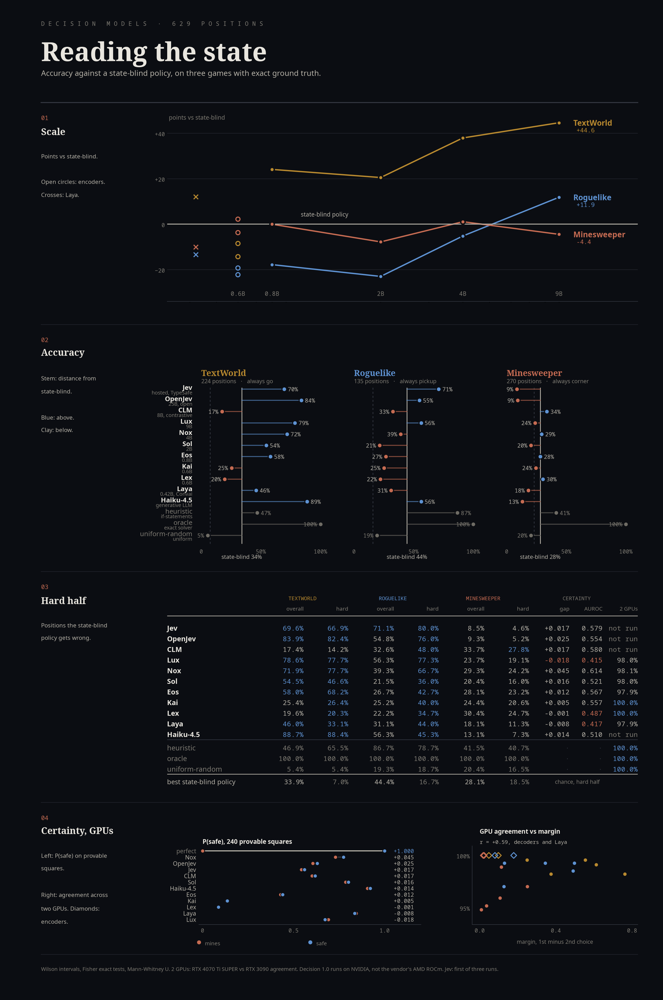
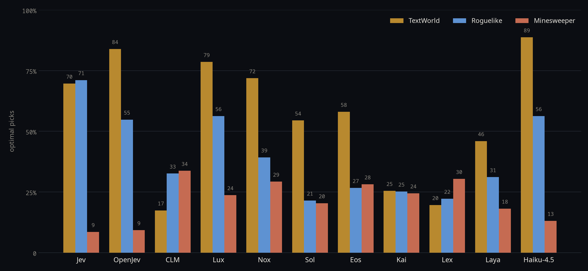

# Reading the State

A benchmark of decision models on three games with exact ground truth:
TextWorld, a roguelike and Minesweeper. Each model is scored against the best
state-blind policy, a fixed rule that never reads the board.

Answerers: six Decision 1.0 models (Kai, Lex, Eos, Sol, Nox, Lux), Laya,
OpenJev, Jev, CLM, Claude Haiku 4.5, and three baselines. All saw the same 629
frozen positions. Every number here comes from the graders' output in
`bench/report/data.json`.



## Summary

- TextWorld: most larger models beat the state-blind policy by a wide margin.
- Minesweeper: no decision model beats it. Jev scores lowest (8.5%).
- Scale helps TextWorld and the roguelike, not Minesweeper. Lux (9B) sits at
  chance on the Minesweeper hard half.
- Giving the model its action history lifts Jev on TextWorld from 70% to 99%.
- With history, Jev wins 57 of 59 whole TextWorld games, the most of any
  answerer.
- No answerer's certainty is usable on provable Minesweeper squares.

## Method

A position is a state, a list of candidate actions, and an exact cost per
candidate. The answerer sees the state and candidates, never the costs. Costs
come from an exhaustive Minesweeper solver, TextWorld's own `policy_commands`
oracle, and hand-built roguelike positions where every move but one is a
blunder.

Each score is compared with three numbers:

- chance, the expected accuracy of a uniform pick
- the best state-blind policy, "always pick actions of kind K"
- the hard half, the positions that policy gets wrong

Beating chance is easy. Beating the state-blind policy is the minimum evidence
that a model reads the state. An answerer that only learned the common move
scores well on the easy half and at chance on the hard half.

Every set is stratified in equal parts, and the state-blind policies are printed
at build time. An earlier roguelike set was 92% one rule, and "always attack"
beat every model on it. That claim was retracted.

Intervals are Wilson. Comparisons are two-sided Fisher exact tests. The
certainty probe uses a tie-corrected Mann-Whitney U.

## Results

Share of positions where the answerer picked an optimal action. "vs
state-blind" is the difference in points, with its Fisher p. The oracle scores
100% everywhere and is left out.

### TextWorld

<!-- table:textworld -->
224 positions. Chance 7.5%. State-blind policy: `always go`, 33.9%. Hard half: 148 positions, chance 7.0%.

| answerer | optimal | 95% CI | vs state-blind (pts) | p | easy half | hard half | hard p vs chance |
|---|--:|--:|--:|--:|--:|--:|--:|
| Haiku-4.5 | 88.7% | 83.9–92.3 | +54.8 | <0.0001 | 89.5% | 88.4% | <0.0001 |
| OpenJev | 83.9% | 78.6–88.2 | +50.0 | <0.0001 | 86.8% | 82.4% | <0.0001 |
| Lux | 78.6% | 72.7–83.4 | +44.6 | <0.0001 | 80.3% | 77.7% | <0.0001 |
| Nox | 71.9% | 65.7–77.4 | +37.9 | <0.0001 | 60.5% | 77.7% | <0.0001 |
| Jev | 69.6% | 63.3–75.3 | +35.7 | <0.0001 | 75.0% | 66.9% | <0.0001 |
| Eos | 58.0% | 51.5–64.3 | +24.1 | <0.0001 | 38.2% | 68.2% | <0.0001 |
| Sol | 54.5% | 47.9–60.9 | +20.5 | <0.0001 | 69.7% | 46.6% | <0.0001 |
| hand-written heuristic | 46.9% | 40.4–53.4 | +12.9 | 0.007 | 10.5% | 65.5% | <0.0001 |
| Laya | 46.0% | 39.6–52.5 | +12.1 | 0.012 | 71.1% | 33.1% | <0.0001 |
| Kai | 25.4% | 20.2–31.5 | -8.5 | 0.062 | 23.7% | 26.4% | <0.0001 |
| Lex | 19.6% | 15.0–25.3 | -14.3 | 0.0009 | 18.4% | 20.3% | 0.001 |
| CLM | 17.4% | 13.0–22.9 | -16.5 | <0.0001 | 23.7% | 14.2% | 0.056 |
| uniform random | 5.4% | 3.1–9.1 | -28.6 | <0.0001 | 5.3% | 5.4% | 0.809 |
<!-- /table -->

### Roguelike

<!-- table:roguelike -->
135 positions. Chance 15.9%. State-blind policy: `always pickup`, 44.4%. Hard half: 75 positions, chance 16.7%.

| answerer | optimal | 95% CI | vs state-blind (pts) | p | easy half | hard half | hard p vs chance |
|---|--:|--:|--:|--:|--:|--:|--:|
| hand-written heuristic | 86.7% | 79.9–91.4 | +42.2 | <0.0001 | 96.7% | 78.7% | <0.0001 |
| Jev | 71.1% | 63.0–78.1 | +26.7 | <0.0001 | 60.0% | 80.0% | <0.0001 |
| Haiku-4.5 | 56.3% | 47.9–64.4 | +11.9 | 0.068 | 70.0% | 45.3% | 0.0002 |
| Lux | 56.3% | 47.9–64.4 | +11.9 | 0.068 | 30.0% | 77.3% | <0.0001 |
| OpenJev | 54.8% | 46.4–63.0 | +10.4 | 0.113 | 28.3% | 76.0% | <0.0001 |
| Nox | 39.3% | 31.4–47.7 | -5.2 | 0.459 | 5.0% | 66.7% | <0.0001 |
| CLM | 32.6% | 25.3–40.9 | -11.9 | 0.060 | 13.3% | 48.0% | <0.0001 |
| Laya | 31.1% | 23.9–39.4 | -13.3 | 0.033 | 15.0% | 44.0% | 0.0003 |
| Eos | 26.7% | 19.9–34.7 | -17.8 | 0.003 | 6.7% | 42.7% | 0.0006 |
| Kai | 25.2% | 18.6–33.1 | -19.3 | 0.001 | 6.7% | 40.0% | 0.002 |
| Lex | 22.2% | 16.0–29.9 | -22.2 | 0.0002 | 6.7% | 34.7% | 0.014 |
| Sol | 21.5% | 15.4–29.1 | -23.0 | <0.0001 | 3.3% | 36.0% | 0.009 |
| uniform random | 19.3% | 13.5–26.7 | -25.2 | <0.0001 | 20.0% | 18.7% | 0.830 |
<!-- /table -->

By rule:

<!-- table:roguelike_strata -->
| answerer | `finish_the_kill` | `heal_or_die` | `take_the_win` |
|---|--:|--:|--:|
| hand-written heuristic | 75.6% | 84.4% | 100.0% |
| Jev | 75.6% | 84.4% | 53.3% |
| Haiku-4.5 | 60.0% | 31.1% | 77.8% |
| Lux | 95.6% | 55.6% | 17.8% |
| OpenJev | 95.6% | 57.8% | 11.1% |
| Nox | 68.9% | 48.9% | 0.0% |
| CLM | 97.8% | 0.0% | 0.0% |
| Laya | 91.1% | 0.0% | 2.2% |
| Eos | 68.9% | 6.7% | 4.4% |
| Kai | 75.6% | 0.0% | 0.0% |
| Lex | 53.3% | 13.3% | 0.0% |
| Sol | 40.0% | 22.2% | 2.2% |
| uniform random | 17.8% | 20.0% | 20.0% |
<!-- /table -->

### Minesweeper

<!-- table:minesweeper -->
270 positions. Chance 22.9%. State-blind policy: `always corner`, 28.1%. Hard half: 194 positions, chance 18.5%.

| answerer | optimal | 95% CI | vs state-blind (pts) | p | easy half | hard half | hard p vs chance |
|---|--:|--:|--:|--:|--:|--:|--:|
| hand-written heuristic | 41.5% | 35.8–47.4 | +13.3 | 0.002 | 43.4% | 40.7% | <0.0001 |
| CLM | 33.7% | 28.3–39.5 | +5.6 | 0.192 | 48.7% | 27.8% | 0.041 |
| Lex | 30.4% | 25.2–36.1 | +2.2 | 0.636 | 44.7% | 24.7% | 0.175 |
| Nox | 29.3% | 24.2–34.9 | +1.1 | 0.849 | 42.1% | 24.2% | 0.216 |
| Eos | 28.1% | 23.1–33.8 | +0.0 | 1.000 | 40.8% | 23.2% | 0.318 |
| Kai | 24.4% | 19.7–29.9 | -3.7 | 0.379 | 34.2% | 20.6% | 0.701 |
| Lux | 23.7% | 19.0–29.1 | -4.4 | 0.280 | 35.5% | 19.1% | 1.000 |
| Sol | 20.4% | 16.0–25.6 | -7.8 | 0.044 | 31.6% | 16.0% | 0.591 |
| uniform random | 20.4% | 16.0–25.6 | -7.8 | 0.044 | 30.3% | 16.5% | 0.689 |
| Laya | 18.1% | 14.0–23.2 | -10.0 | 0.008 | 35.5% | 11.3% | 0.064 |
| Haiku-4.5 | 13.1% | 9.6–17.7 | -15.0 | <0.0001 | 27.6% | 7.3% | 0.002 |
| OpenJev | 9.3% | 6.4–13.3 | -18.9 | <0.0001 | 19.7% | 5.2% | <0.0001 |
| Jev | 8.5% | 5.7–12.5 | -19.6 | <0.0001 | 18.4% | 4.6% | <0.0001 |
<!-- /table -->



## Task differences

TextWorld is text matching. The objective and the candidates are sentences, and
the distractors (`look`, `inventory`, `examine X`) are plainly useless. Going
from the 0.6B encoders to the 9B Lux moves TextWorld from 19.6% to 78.6%.

Minesweeper is arithmetic. On the hard half, none of the six Decision 1.0
models beats chance. Lux scores 19.1% against a chance rate of 18.5% (p =
1.000). CLM is the only decision model above chance there, at 27.8% (p =
0.041), still well below the hand-written heuristic's 40.7%.

The roguelike splits by rule. Models handle `finish_the_kill` well (Lux 95.6%).
Most Decision 1.0 models score near zero on `take_the_win`, where the amulet
that ends the game is in reach: 0.0% for Nox, Kai and Lex. That move's value is
stated only in the objective. Jev (53.3%) is the only decision model that
takes the win reliably.

Haiku 4.5 (13.1%), OpenJev (9.3%) and Jev (8.5%) score below uniform random on
Minesweeper (20.4%). Only Haiku misreads the grid: with its pick's column and
row swapped, it would be right 37.9% of the time against 25.0% for a random
candidate.

## Certainty

240 Minesweeper squares whose status the numbers prove, 120 safe and 120 mined.
Each answerer rated "this square does not contain a mine". The right answer is
exactly 1.0 or 0.0.

<!-- table:certainty -->
| answerer | gap (safe − mine) | AUROC | p | distinct values |
|---|--:|--:|--:|--:|
| Nox | +0.045 | 0.614 | 0.002 | 234 |
| CLM | +0.017 | 0.580 | 0.033 | 216 |
| Jev | +0.017 | 0.579 | 0.033 | 36 |
| Eos | +0.012 | 0.567 | 0.073 | 224 |
| Kai | +0.005 | 0.557 | 0.124 | 209 |
| OpenJev | +0.025 | 0.554 | 0.149 | 33 |
| Sol | +0.016 | 0.521 | 0.576 | 235 |
| Haiku-4.5 | +0.014 | 0.510 | 0.732 | 38 |
| Lex | -0.001 | 0.487 | 0.720 | 185 |
| Laya | -0.008 | 0.417 | 0.026 | 148 |
| Lux | -0.018 | 0.415 | 0.023 | 231 |
<!-- /table -->

No answerer passes. The models give up to 235 distinct values, uncorrelated with
the answer. Lux orders them slightly backwards (AUROC 0.415, p = 0.023). Jev
and CLM reach AUROC 0.58 (p = 0.033), but their gaps are +0.017, too small to
use.

## Calibration

Does confidence in a pick predict whether it is right? First number: AUROC,
where 0.5 means confidence is useless. Second: mean confidence minus accuracy,
where positive means overconfident. Haiku returns no distribution and is not
scored.

<!-- table:calibration -->
| model | TextWorld AUROC / over | Roguelike AUROC / over | Minesweeper AUROC / over |
|---|--:|--:|--:|
| Jev | 0.78 / +0.12 | 0.77 / -0.17 | 0.50 / +0.17 |
| OpenJev | 0.86 / +0.07 | 0.80 / +0.18 | 0.51 / +0.21 |
| CLM | 0.70 / +0.30 | 0.85 / +0.42 | 0.51 / -0.11 |
| Laya | 0.58 / +0.39 | 0.70 / +0.33 | 0.44 / +0.21 |
| Lux | 0.79 / -0.11 | 0.73 / -0.03 | 0.46 / -0.10 |
| Nox | 0.85 / +0.01 | 0.40 / +0.27 | 0.54 / -0.04 |
| Sol | 0.75 / -0.02 | 0.67 / +0.13 | 0.58 / +0.05 |
| Eos | 0.72 / -0.15 | 0.69 / +0.06 | 0.57 / -0.19 |
| Kai | 0.59 / +0.01 | 0.76 / +0.12 | 0.55 / -0.13 |
| Lex | 0.55 / -0.01 | 0.71 / +0.07 | 0.61 / -0.18 |
<!-- /table -->

On Minesweeper, confidence means nothing for any model. On TextWorld and the
roguelike it does (0.67–0.86 for most models). A low-confidence pick there is
a real warning. CLM (+0.42) and Laya (+0.33) are overconfident on the roguelike.
Nox's roguelike confidence runs backwards (0.40).

## Second GPU

The Decision 1.0 models are built for AMD ROCm and ran on NVIDIA. To check the
port, the same positions and weights ran on an RTX 3090 and an RTX 4070 Ti
SUPER. Cells show agreement, with the accuracy change in points.

<!-- table:crossdevice -->
| model | TextWorld agree (Δ pts) | Roguelike agree (Δ pts) | Minesweeper agree (Δ pts) |
|---|--:|--:|--:|
| Lux | 99.6% (-0.4) | 99.3% (+0.7) | 95.2% (-0.7) |
| Nox | 99.1% (-0.4) | 99.3% (-0.7) | 95.9% (+0.4) |
| Sol | 98.2% (+0.9) | 97.0% (-1.5) | 98.9% (+0.0) |
| Eos | 99.6% (+0.0) | 99.3% (+0.7) | 94.8% (-0.4) |
| Lex | 100.0% (+0.0) | 100.0% (+0.0) | 100.0% (+0.0) |
| Kai | 100.0% (+0.0) | 100.0% (+0.0) | 100.0% (+0.0) |
| Laya | 98.2% (+0.0) | 98.5% (+0.7) | 97.0% (+0.0) |
| heuristic | 100.0% (+0.0) | 100.0% (+0.0) | 100.0% (+0.0) |
| oracle | 100.0% (+0.0) | 100.0% (+0.0) | 100.0% (+0.0) |
| uniform-random | 100.0% (+0.0) | 100.0% (+0.0) | 100.0% (+0.0) |
<!-- /table -->

No accuracy moved more than 1.5 points. Kai and Lex matched on all 629
positions. The decoder models differ where their top two choices are close.
Lux's mean margin is 0.554 on TextWorld (99.6% agreement) and 0.036 on
Minesweeper (95.2%). Across the decoders and Laya, r = +0.59 over 15 task-model
pairs.

## Models

### Jev

TypeSafe's hosted model, `jev-1.13.0`, called at `api.typesafe.ai/v1/systemone`
on 26–27 September 2026. No errors, missing or invalid answers.

- Best decision model on the roguelike: 71.1%, and 80.0% on the hard half.
- Only decision model that takes the win (53.3%).
- TextWorld 69.6%, behind OpenJev, Lux and Nox. Action history closes the gap.
- Minesweeper 8.5%. 207 of the 219 provable squares it picked were mines (95%,
  against 76% for uniform random). It picks the most dangerous candidate 78% of
  the time.

Jev is not deterministic. Repeat runs:

<!-- table:jev_repeats -->
| task | Jev, three runs | all three picked the same |
|---|--:|--:|
| TextWorld | 69.6% / 71.4% / 72.3% | 93.8% |
| Roguelike | 71.1% / 71.9% / 73.3% | 91.9% |
| Minesweeper | 8.5% / 8.1% / 7.4% | 79.6% |
<!-- /table -->

The tables use the first run. As a hosted service, it has no weights to check,
and the version behind a name can change.

### OpenJev

A ~25B open-weights model (CC BY-NC 4.0) on a Qwen3.5 backbone. Its model card
says it is not affiliated with TypeSafe.

- Best non-generative answerer on TextWorld (83.9%).
- Matches Lux on the roguelike (54.8% against 56.3%), including the failure on
  `take_the_win` (11.1%).
- Minesweeper 9.3%. 195 of 210 provable picks were mines (93%).

It ships no reference output, so this serving stack cannot be checked against
the author's numbers. It ran as the FP8 build with 12 GiB offloaded to host RAM,
on a card without native FP8. The engine crashed once. All 207 earlier answers
reproduced exactly after the restart.

### CLM

CLM-8B (Contrastive-LM, Apache 2.0). A frozen Qwen3-8B embeds the state and each
candidate separately, and the closest candidate wins. Its release claims it is
"on par with Jev".

- TextWorld 17.4%, below "always go" (33.9%).
- Roguelike 32.6%: `finish_the_kill` 97.8%, `heal_or_die` and `take_the_win` 0%.
- Minesweeper 33.7%, first among the models. 53% of its provable picks were
  mines, against 76% for uniform random (p = 0.0002).

Because a candidate like `close door` is embedded without the state, the model
cannot tell whether the door is already closed. The documented reference output
did not reproduce (Noul 0.82–0.85 against the documented 0.410), so these
numbers are for the head as released (`CLM_v0.1-8B.pt`, sha256 `b2b4a8c9…`). A
full repeat run matched within 0.4 points. Median latency was 120 ms against
Jev's 195 ms, but CLM ran locally and Jev over the internet.

`clm-serve` binds to 0.0.0.0 with no authentication by default. Always pass
`--host 127.0.0.1`.

## Action history

TextWorld positions give the objective, room and inventory, but not what has
already been done. Most of Jev's errors were repeated steps: 47 of its 53 wrong
`go` moves were directions from the objective.

Each position was rebuilt from its seed (all 224 matched byte for byte), and the
oracle's moves so far were added as one line, `ACTIONS TAKEN SO FAR`. Nothing
else changed.

<!-- table:history -->
| answerer | no history | with history | fixed | broken | p | late, no history | late, with history |
|---|--:|--:|--:|--:|--:|--:|--:|
| Jev | 69.6% | 99.1% | 66 | 0 | <0.0001 | 51.2% | 100.0% |
| OpenJev | 83.9% | 98.7% | 33 | 0 | <0.0001 | 75.2% | 99.2% |
| CLM | 17.4% | 18.8% | 7 | 4 | 0.549 | 9.1% | 11.6% |
| Haiku-4.5 | 87.9% | 99.1% | 26 | 1 | <0.0001 | 81.0% | 99.2% |
| Lux | 78.6% | 94.2% | 40 | 5 | <0.0001 | 65.3% | 92.6% |
| Nox | 71.9% | 95.1% | 56 | 4 | <0.0001 | 53.7% | 95.9% |
| Sol | 54.5% | 69.2% | 41 | 8 | <0.0001 | 38.0% | 61.2% |
| Eos | 58.0% | 79.0% | 48 | 1 | <0.0001 | 45.5% | 73.6% |
| Kai | 25.4% | 26.8% | 12 | 9 | 0.664 | 24.8% | 24.0% |
| Lex | 19.6% | 14.7% | 2 | 13 | 0.007 | 13.2% | 8.3% |
| Laya | 46.0% | 41.1% | 12 | 23 | 0.090 | 29.8% | 26.4% |
| hand-written heuristic | 46.9% | 46.9% | 0 | 0 | 1.000 | 39.7% | 39.7% |
<!-- /table -->

- Jev goes from 70% to 99%, OpenJev from 84% to 98.7%, Haiku from 88% to 99.1%.
- The larger decoders gain 15–23 points.
- The encoders, Laya and CLM do not improve. Lex gets worse (p = 0.007).

With history the task is mostly matching the done list against the objective, so
near-100% does not mean deep reasoning. The history is the oracle's path, so it
also tells the model every step so far was right. The main tables do not use it.

TypeSafe's guide for Jev also recommends named JSON fields. Tested on Jev, JSON
made no difference: 70.5% against 69.6% without history (p = 0.83), and 98.7%
against 99.1% with it.

## Whole games

Every answerer played the same 59 TextWorld games from start to finish, with its
own action history each turn. The move limit is three times optimal, at least
15. The oracle wins all 59.

<!-- table:games -->
| player | won | 95% CI | moves / optimal (wins) | games ending in a loop | single-step accuracy with history |
|---|--:|--:|--:|--:|--:|
| oracle | 59/59 | 93.9–100.0 | 1.00× | 0 | — |
| Jev | 57/59 | 88.5–99.1 | 1.01× | 2 | 99.1% |
| Haiku-4.5 | 56/59 | 86.1–98.3 | 1.02× | 0 | 99.1% |
| OpenJev | 53/59 | 79.5–95.3 | 1.03× | 5 | 98.7% |
| Lux | 52/59 | 77.5–94.1 | 1.04× | 6 | 94.2% |
| Nox | 47/59 | 67.7–88.0 | 1.17× | 11 | 95.1% |
| Eos | 26/59 | 32.2–56.7 | 1.09× | 31 | 79.0% |
| Sol | 11/59 | 10.7–30.4 | 1.23× | 45 | 69.2% |
| Laya | 4/59 | 2.7–16.2 | 2.40× | 11 | 41.1% |
| Kai | 2/59 | 0.9–11.5 | 3.45× | 41 | 26.8% |
| Lex | 1/59 | 0.3–9.0 | 3.50× | 44 | 14.7% |
| uniform random | 1/59 | 0.3–9.0 | 5.00× | 0 | — |
| CLM | 0/59 | 0.0–6.1 | — | 55 | 18.8% |
| hand-written heuristic | 0/59 | 0.0–6.1 | — | 50 | 46.9% |
<!-- /table -->

- Jev 57, Haiku 56, OpenJev 53, Lux 52. The differences among these four are not
  significant. Jev over Nox (47) is (p = 0.006).
- Winners waste almost no moves (1.01–1.04× optimal).
- Weaker models loop, repeating `take X`, `put X` until moves run out. CLM does
  this in 55 of 59 games and wins none.
- Neither memoryless baseline wins a game.

Local models were served over the same HTTP request as hosted ones. Haiku played
through a one-command interface. All 400 of its commands were audited.

## Minesweeper fixes

Jev's Mario and Doom demos work because code reads the game memory and hands the
model a clean description. Minesweeper got the same treatment: the grid was
replaced by one constraint per line, such as `2: c5r3 c6r3`. The board is
described, never solved. 30 positions that exceed the encoders' 1,024-token
limit were dropped for everyone.

<!-- table:ms_structured -->
240 positions. State-blind `always corner`: 28.1%. Hard half chance 18.5%.

| answerer | grid | structured | p | hard, grid | hard, structured | provable picks that are mines |
|---|--:|--:|--:|--:|--:|--:|
| Jev | 7.1% | 8.8% | 0.503 | 4.2% | 7.9% | 94.7% |
| OpenJev | 8.8% | 17.1% | 0.002 | 7.9% | 13.1% | 87.7% |
| CLM | 36.7% | 30.0% | 0.002 | 34.0% | 28.3% | 55.0% |
| Laya | 18.3% | 16.2% | 0.533 | 14.1% | 9.9% | 82.8% |
| Lux | 25.0% | 24.2% | 0.896 | 20.9% | 17.8% | 73.8% |
| Nox | 31.2% | 33.8% | 0.532 | 25.1% | 25.1% | 50.0% |
| Sol | 18.8% | 20.4% | 0.683 | 13.6% | 15.2% | 80.8% |
| Eos | 29.2% | 17.5% | 0.0005 | 24.6% | 17.3% | 83.1% |
| Kai | 23.8% | 17.9% | 0.024 | 22.5% | 17.8% | 83.5% |
| Lex | 31.2% | 24.2% | 0.014 | 30.9% | 24.1% | 75.8% |
| Haiku-4.5 | 12.5% | 25.4% | <0.0001 | 8.4% | 18.3% | 73.8% |
| hand-written heuristic | 42.5% | 42.5% | 1.000 | 41.4% | 41.4% | 35.5% |
<!-- /table -->

Nothing beats the state-blind policy. Haiku and OpenJev roughly double but stay
below "always corner" (28.1%). Jev barely moves. The rest are flat or worse.

Next, the same grids were asked with the goal reversed: find the square most
likely to be a mine.

<!-- table:ms_wording -->
Mean true mine probability of the picked square. A random candidate: 0.59.

| model | “least likely to be a mine” | “safe” | “most likely to be a mine” | same pick when the goal is reversed |
|---|--:|--:|--:|--:|
| Jev | 0.85 | 0.86 | 0.88 | 70% |
| OpenJev | 0.82 | 0.79 | 0.80 | 27% |
| CLM | 0.46 | 0.45 | 0.45 | 91% |
| Lux | 0.63 | 0.63 | 0.70 | 66% |
| Nox | 0.47 | 0.45 | 0.48 | 77% |
| Sol | 0.64 | 0.62 | 0.64 | 75% |
| Eos | 0.57 | 0.56 | 0.53 | 57% |
| Kai | 0.57 | 0.55 | 0.55 | 91% |
| Lex | 0.50 | 0.50 | 0.50 | 91% |
| Laya | 0.65 | 0.65 | 0.65 | 99% |
<!-- /table -->

No model follows the goal. Picks stay about as dangerous whichever way the
question is asked, and most models keep most of their picks. Jev goes for the
most mine-like squares (0.85 against 0.59 for random). CLM sits at the other end
(0.46), which is why it tops the grid table. Presentation cannot fix this.
TypeSafe's own guide says to keep rules and calculations in code.

Haiku was not run on the reversed-goal test.

## Corrections

Each of these changed a published number.

- Retracted: the first roguelike set was 92% one rule. It was rebuilt 45/45/45.
- Confound: fixed candidate order was worth up to 64 points. Order is now
  shuffled per position.
- Overclaimed: a danger AUROC of 0.995 was reported. An HP-only baseline scored
  0.98.
- Underpowered: the Minesweeper null rested on 60 hard positions. The set was
  rebuilt at 270, with a hard half of 194.
- Silent bias: two failed Haiku batches were both `heal_or_die`, its worst rule.
  Its roguelike score dropped from 82.9% to 76.3% once filled in.
- Superseded: a Haiku certainty gap of +0.820 came from an unbalanced draw (193
  mines, 47 safe). Balanced 120/120, it was +0.345.
- Wrong premise: Lux-9B was skipped on a stated 18 GiB requirement. Its backbone
  is 14.78 GiB, and it now runs with partial offload.
- Not reproducible: the random baselines shared one RNG per run. They now seed
  per position.
- Unequal prompts: Haiku's first prompts carried task hints the models did not
  get. Without them, its roguelike score fell from 76.3% to 56.3% and its
  certainty gap from +0.345 to +0.014.
- Code execution: in the first Haiku run, 78 of 104 agents sliced the shared
  files with `jq` or Python, and 17 wrote scoring scripts. Each agent now gets its
  own small batch file, and all 161 transcripts were audited.
- Retracted: "Jev and OpenJev misread the grid." Their swapped squares score like
  random candidates. Only Haiku's do better.
- Mislabelled: Haiku's roguelike bar was drawn as a decision model. The data is
  now built by script.
- Stale value: Haiku's whole-games step accuracy was shown as 99.6%. It is 99.1%.
- Now enforced: the grader flags any answerer whose missing answers fall unevenly
  across strata.

## Reproducing

All answers are in `bench/answers/`. Rebuilding needs only the standard library:

```bash
python3 bench/grade.py && python3 bench/breakdown.py && python3 bench/grade_certainty.py
python3 bench/crossdevice.py --other bench/answers-3090 --label "RTX 3090"
python3 bench/fairness.py        # every answerer on every test, inputs pinned by sha256
python3 bench/report/build.py    # data.json
python3 bench/report/tables.py   # the tables in this README
```

Each experiment in `bench/experiments/` has its own grader and `summary.json`.

### Hosted answerers

Configured from the environment. Never put a key on the command line or in the
repository.

```bash
export JEV_BASE_URL="https://api.typesafe.ai"
export JEV_API_KEY="..."          # never commit this
export JEV_MODEL="jev-1.13.0"
python3 bench/run_answerer.py --answerer http:JEV --env all --limit 5   # smoke test
python3 bench/run_answerer.py --answerer http:JEV --env all
python3 bench/run_certainty.py --answerer http:JEV                      # never pass --rebuild
```

Check that `invalid` is 0 on the smoke test first. A full pass is about 630
requests of 400–1,100 input tokens. Run a nondeterministic model more than once.
Any prefix works: `http:NAME` reads `NAME_BASE_URL`.

### Local models

`PROTOCOL.md` covers setup. Decision 1.0 runs on NVIDIA with AMD-only guards
patched in memory, and each run is checked against the vendor's reference
output. Lux-9B does not fit a 16 GiB card, so part of it streams from host RAM.
Two different offload splits gave identical outputs. OpenJev and CLM ran on the
RTX 3090 on loopback-only servers. `scripts/` has the exact commands.

### Haiku

Haiku 4.5 read the same positions, eight or nine per agent, with only format
rules and each position's instructions. No agent ran a command. Haiku can reason
before answering and the decision models cannot, which favours Haiku.

## Layout

```
bench/spec.py                position format, baselines, Wilson, Fisher
bench/export_*.py            build the three position sets
bench/answerers.py           Decision 1.0, Laya, HTTP answerer, baselines
bench/run_answerer.py        run one answerer on one task
bench/run_certainty.py       certainty probe
bench/serve_local.py         serve a local answerer over HTTP
bench/grade.py               main table
bench/breakdown.py           strata and hard half
bench/grade_certainty.py     certainty gap and AUROC
bench/crossdevice.py         compare two machines
bench/fairness.py            completeness and input checks
bench/make_figure.py         comparison.png
bench/make_bars.py           bars.png
bench/positions/             frozen positions
bench/answers/               every graded answer
bench/answers-3090/          second-GPU answers
bench/answers-haiku-*/       superseded Haiku runs
bench/experiments/           side experiments
bench/report/                data.json, figures, tables.py
harness/                     roguelike and Minesweeper games, model loaders
scripts/                     serve and batch scripts
PROTOCOL.md                  setup and protocol
```

Model weights are not included.

## License

MIT. See `LICENSE`. Model weights, TextWorld and the vendor code each keep their own licenses.
